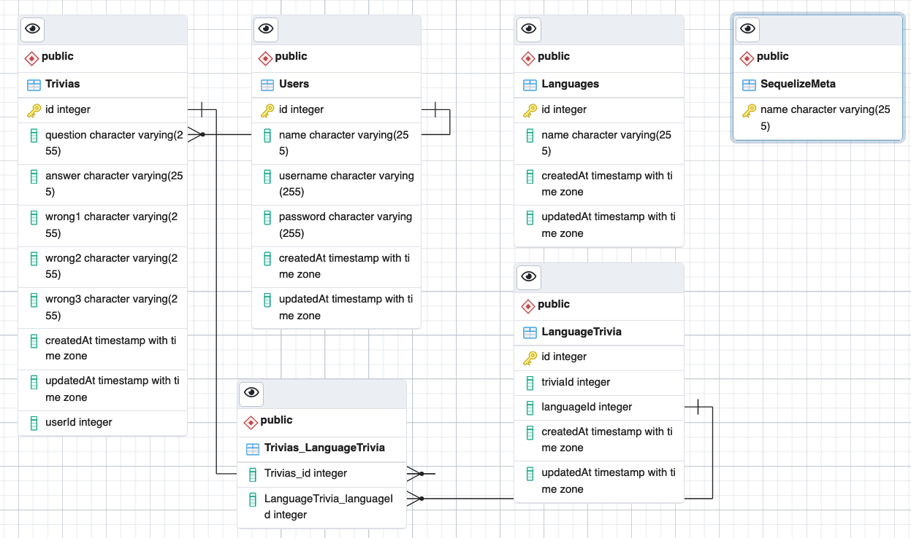
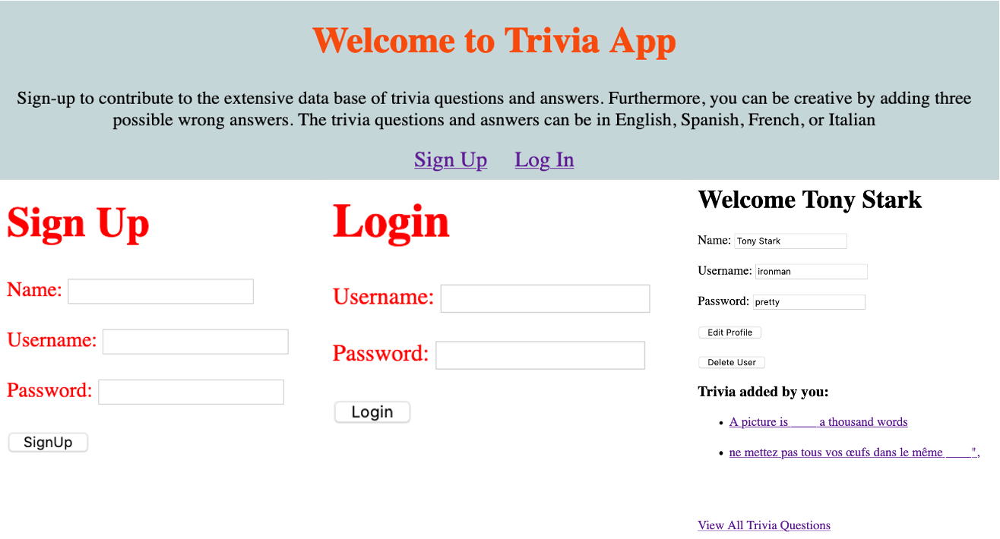
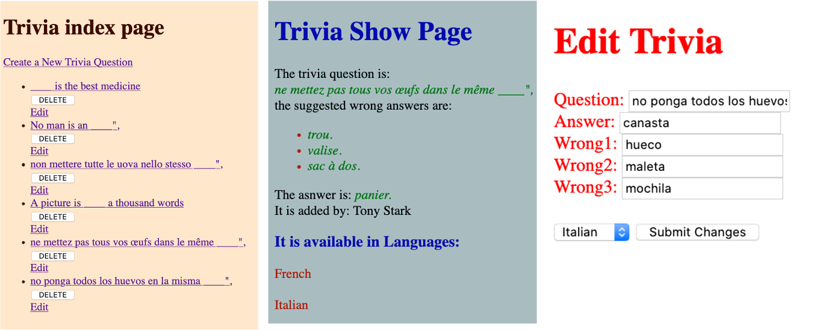

# Project Overview
This project provides an app that allows users to catalogue trivia or multiple choice exam questions in several languages, link each question to four possible answers, and also identify the correct answer.  The questions and solutions can be used by teachers for their multiple choice tests, trivia game developers, and language instructors among others.
 
## Project Description

For this project, a full CRUD (Create, Read, Update, Delete) app using the Node.js, Postgres, Express and EJS tools to develop the code . In addition to adhering to the MVC structures (Models, Views, Controllers) for the app.
The tables and data will be sequelize and the project will be deployed in Heroku.

## Project Links

- [https://github.com/Grajales/tables_project2]()
- [https://dashboard.heroku.com/apps/associatedtablesprj2]()

## Definitions

Here is a list of the process and tools used

- [RESTful components](https://gist.github.com/alexpchin/09939db6f81d654af06b)


### User Stories

User Stories:
1.	As a developer I want specify the table structures  so that I can use them as seeders
2.	As a developer I want specify the steps require to sequelize so that I can use them to develop the code (Node.js, Postgres, Express and EJS)

3.	As a developer I want write the starter files so that I can start creating code


4.	As a developer I want develop the MVC structures  so that I can use for the app (Models, Views, Controllers)

5.	As a developer I want to develop 7 RESTful routes and full CRUD.
so that I and others can enter, edit, and delete list data  (RESTful: Post, Put, Get) and (CRUD:Create, Read, Update, Delete)

6.	As a developer I want to sequelize the data so I can easily create, edit, and update tables 

7.	As a developer I want create seed tables so that I and others can enter future data to the lists

8.	As a developer I want to code in CSS so that the webpage has some user friendly features and appealing view

9.	As a developer I want to deploy the project in Heroku so that I and others can run the app online

10.	As a developer I want document the code in a readme file so that I and others can understand the project
  

#### MVP EXAMPLE
- Find and use external api 
- Render data on page 
- Allow user to interact with the page

#### Final Table Relations

-  <br>
User Restful Routes
- <br>
Trivia Restful Routes
- <br>
Nodemon links:
- [http://localhost:3000/trivias]()
- [http://localhost:3000/users]()<br>
Heruko Links:<br>
- [https://associatedtablesprj2.herokuapp.com/trivias]()
- [https://associatedtablesprj2.herokuapp.com/trivias/2]()
- [https://associatedtablesprj2.herokuapp.com/trivias/1/edit]()
- [https://associatedtablesprj2.herokuapp.com/users/signup]()
- [https://associatedtablesprj2.herokuapp.com/users/login]()


## Time Frames

Time frames are also key in the development cycle.  You have limited time to code all phases of the game.  Your estimates can then be used to evalute game possibilities based on time needed and the actual time you have before game must be submitted. It's always best to pad the time by a few hours so that you account for the unknown so add and additional hour or two to each component to play it safe. Also, put a gif at the top of your Readme before you pitch, and you'll get a panda prize.

| Component | Priority | Estimated Time | Actual Time |
| --- | :---: |  :---: | :---: |
| Adding Form | H | 3.5 hrs | 4 hrs |
| Working with API | H | 10 hrs| 12 hrs |
| Total | H | 13.5 hrs| 16 hrs |

## References
 Use this section to list all supporting libraries and thier role in the project such as Axios, ReactStrap, D3, etc. 

## Code Snippet

The following code shows how I had to modify the reference "Trivia" to "Trivias" in the trivia.js file.

```
'use strict';
const {
  Model
} = require('sequelize');
module.exports = (sequelize, DataTypes) => {
  class Trivias extends Model {

    static associate(models) {
      Trivias.belongsTo(models.User, { foreignKey: "userId" });
      Trivias.belongsToMany(models.Language, {
        through: "LanguageTrivia",
        foreignKey: "triviaId",
        otherKey: "languageId",
      });
    }
  };
  Trivias.init({
    question: DataTypes.STRING,
    answer: DataTypes.STRING,
    wrong1: DataTypes.STRING,
    wrong2: DataTypes.STRING,
    wrong3: DataTypes.STRING,
    userId: DataTypes.INTEGER,
  }, {
    sequelize,
    modelName: 'Trivias',
  });
  return Trivias;
};
```

## Issues and Resolutions
 When creating the models, using "npx sequelize model:generate --name Trivia --attributes question:string,answer:string,wrong1:string,wrong2:string,wrong3:string", the action did not add an "s" to Trivia. So I manually added the "s" to align with the "Fruits" model, this created many problems, so the solution was to modify all "Trivia" references to be "Trivias" in the Trivia.js model file.

#### SAMPLE
**ERROR**: Trivia relation not found                                
**RESOLUTION**: See Issues and Resolutions

## Future additions
1. I would like to change the view of the index.ejs page so it organizes the questions in columns for each language.
2. I would like to add a redirect option in the show.ejs file in the list of available languages, when one clicks on a language, it directs the user to the same question in another language. 